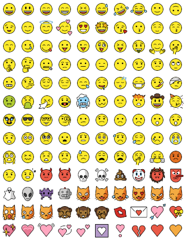
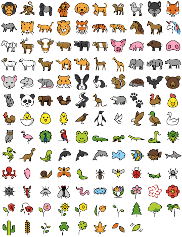

# openmoji-spritemap-generator

This lib generates merged sprite sheets from [OpenMoji](https://openmoji.org/) emojis. A sprite sheet is an image that is composed from smaller images and where every small image has a known position. Emoji sprite sheets allow web developers to build emoji pickers by reducing number of individual images from hundreds to just a few, thus making web sites and apps load quickly.

In addition to sprite sheet images, either PNG or SVG, this lib generates a CSS, HTML, and JSON data files that each contains the emoji positions. The CSS uses [the background-position method](https://css-tricks.com/css-sprites/) and the HTML represents the sheet with `<map>` and `<area>` tags. The JSON is targeted for custom usage. Pick the one that suits you the best.

For pre-generated sprite sheets, see [openmoji-sprites](https://axelpale.github.io/openmoji-sprites/).

## Example output

&nbsp; &nbsp;

Sprite sheets, HTML snippets, CSS sprites, and JSON sprite data.
- [smileys-emotion.png](doc/smileys-emotion.png)
- [smileys-emotion.html](doc/smileys-emotion.html)
- [smileys-emotion-sample.json](doc/smileys-emotion-sample.json)
- [smileys-emotion.css](doc/smileys-emotion.css)
- [smileys-emotion-css.html](doc/smileys-emotion-css.html)
- [animals-nature.png](doc/animals-nature.png)
- [animals-nature.html](doc/animals-nature.html)
- [animals-nature-sample.json](doc/animals-nature-sample.json)
- [animals-nature.css](doc/animals-nature.css)
- [animals-nature-css.html](doc/animals-nature-css.html)

## Usage

For instructions how to use the generated sheets, see [CSS Sprites article by CSS-Tricks](https://css-tricks.com/css-sprites/). For instructions how to use the generator, see below.

There is two intended ways to use the generator. The first is by installing it as a Node.js module into your own project and commanding it via API. The second way is more standalone, and allows you to generate sprite sheets without a host project.

Both ways require you to download the OpenMoji emojis and their associated metadata to your project directory. OpenMoji provides multiple alternative sets in different formats, colors and sizes. Therefore it is up to you which emoji set to use. Use the following to download latest 72px wide colored emojis and their metadata.

    $ wget https://github.com/hfg-gmuend/openmoji/releases/latest/download/openmoji-72x72-color.zip
    $ wget https://github.com/hfg-gmuend/openmoji/raw/master/data/openmoji.json

You need to unzip the emoji zip package and place the directory next to `openmoji.json`. You will give paths to these two in the next step.

## Usage via API

First, install the module into your project via [NPM](https://www.npmjs.com/package/openmoji-spritemap-generator):

    $ npm install openmoji-spritemap-generator

Second, include it in your source code with the emoji metadata:

    const generate = require('openmoji-spritemap-generator')
    const mojis = require('openmoji.json')

Third, provide configuration object. You need to specify the path to the unzipped emoji directory and target directory for the generated files. See the [API docs](#api) further below for details.

    generate({
      name: 'animals-nature',
      emojis: mojis.filter(moji => moji.group === 'animals-nature'),
      emojiDir: 'openmoji-72x72-color',
      targetDir: 'target',
      emojiSize: 72,
      columns: 10,
      backgroundColor: '#FFFFFF00'
    }, (err) => {
      if (err) { throw err }
      console.log('Spritemap generated!')
    })

Finally, admire the fresh sprite sheets under `target/`!

## Usage as standalone project

First, clone this repository to your machine.

    $ git clone <git url to this repo>
    $ cd openmoji-spritemap-generator

Second, install dependencies (and the emojis, see above).

    $ npm install

Third, modify the default configuration in `run.js` as you wish. The default behaviour will first group the emojis by their group classes and then call `generate` for each group separately.

Fourth, check your code for errors.

    $ npm test

If code ok then run it. Multiple sprite sheets will be generated under `target/`.

    $ npm start

Finally, see the merged sheets and image map HTML under `target/`.

## API

### generate(config, callback)

Generates a sprite sheet image, a CSS sheet, a sprite data JSON, and an image map HTML snippet. Takes in configuration object and a callback function. The callback is invoked after generation has finished and with `err` if an error occurred.

The configuration object `config` can take following options.

- name: A string. A unique name for this emoji set. Affects file prefixes, html classes, and console output.
- emojis: An array of emoji objects originating from openmoji.json. The order defines the order in the output.
- mode: Either 'png' or 'svg'. Do we merge PNG or SVG images. Default is 'png'.
- emojiDir: A directory path to emoji images, either PNG or SVG downloaded from OpenMoji.
- targetDir: A directory path where to save the generated files.
- emojiSize: An integer. The pixel width (=height) of emojis in emojiDir. Default is `72`.
- columns: An integer. How many emojis to place on a single sprite sheet row. Default is `10`.
- backgroundColor: A string, parsed by [color](https://www.npmjs.com/package/color). Transparent by default.

Additional notes:
- Resizing emojis is not currently supported. You must resize the emojis beforehand and provide matching `emojiSize`.

## Known problems

### Bus error: 10

Happens at least on macOS 10.14 with Node 8.15, Node 10.20, and Node 12.16 when there is more than 200 emojis to be merged. Cause unsure but has something to do with memory management. As a quick workaround, try to merge less emojis.

## See also

- [CSS Sprites by CSS-Tricks](https://css-tricks.com/css-sprites/)
- [OpenMoji.org](https://openmoji.org/)
- [openmoji-sprites](https://axelpale.github.io/openmoji-sprites/)
- [svg-sprite](https://www.npmjs.com/package/svg-sprite)

## Licence

The generated sprite sheets are licensed under [CC-BY-SA 4.0](https://creativecommons.org/licenses/by-sa/4.0/). The source code is licensed under [MIT License](LICENSE).
